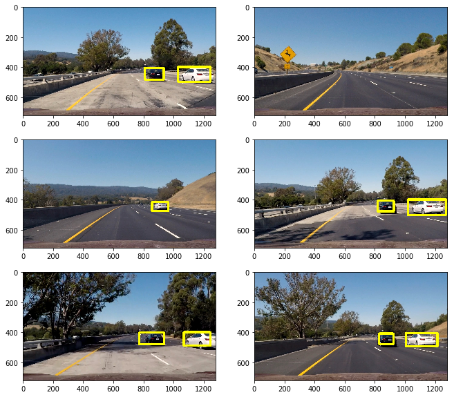

# Vehicle Detection 车辆检测

基于YOLO模型的车辆检测

video1: 

video2: 

The Project
---

使用已训练好的权重文件（基于COCO数据集），[下载链接]()。YOLO相关原理参见参考链接, 测试图像如下:

CNN模型：

参考链接：

[You Only Look Once: Unified, Real-Time Object Detection](http://link.zhihu.com/?target=http%3A//blog.csdn.net/surgewong/article/details/51864859)

[图解YOLO](https://zhuanlan.zhihu.com/p/24916786?refer=xiaoleimlnote)

