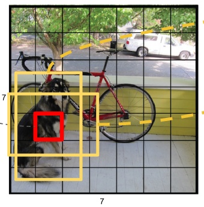
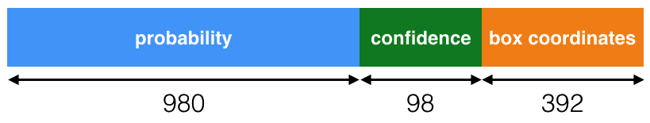
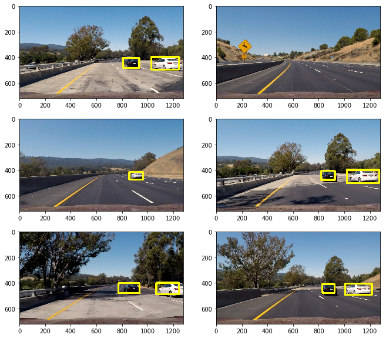
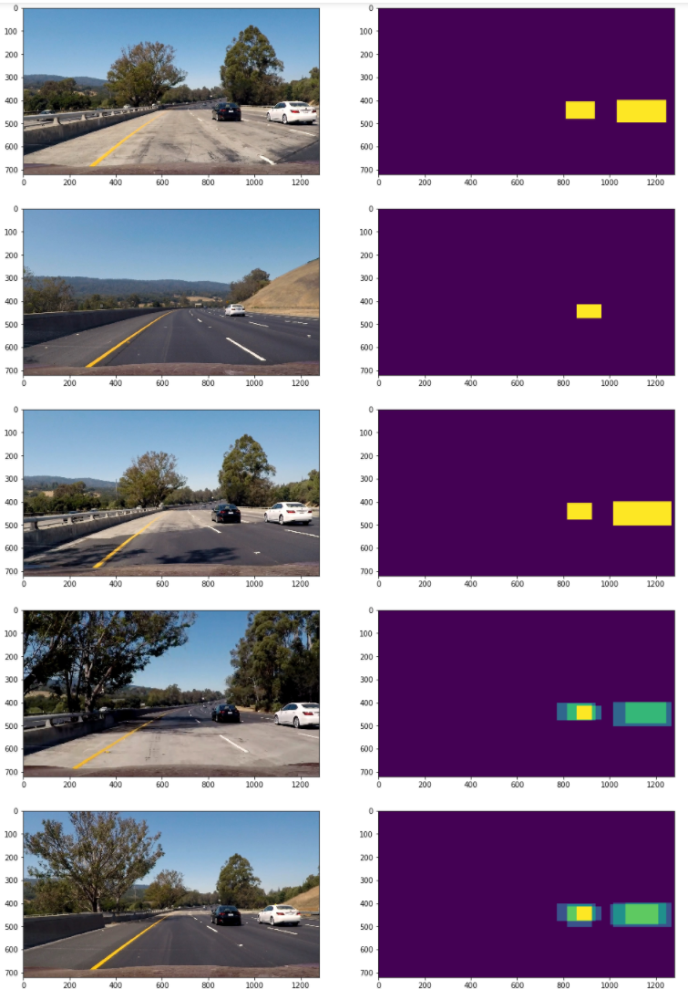

## Car Detection Project Writeup
[Rubric](https://review.udacity.com/#!/rubrics/513/view) points

Here I will consider the rubric points individually and describe how I addressed each point in my implementation.

CNN model has changed object detection. Traditional method (features extraction + classifier HOG+SVM) is lower accuracy and slower FPS than CNN model. We could easy to implement the pipeline of detection and get better result. Unlike R-FCN and Fast/Faster R-CNN, YOLO and SSD is **not region-based** detector, and is easier to implement and suitable for real-time applications and end-to-end training/learning.

--------------------------------------

### Writeup

#### 1. Provide a Writeup / README that includes all the rubric points and how you addressed each one.  

You're reading it!

## You only look once (YOLO)

#### 1. How I use the trained weights from the training images.

I use the [COCO](http://mscoco.org/)(Common Objects in Context) dataset trained weights file to my detector because this dataset has bigger trained samples.

The code for this step is contained in the second code cell of the IPython notebook，`load_trained_weights()`, and pre-trained weight file could download [here](https://pjreddie.com/media/files/tiny-yolo.weights).

#### 2. How I build the tiny YOLO model using Keras.

As tiny YOLO model picture, I build the CNN model by using Keras, see the python file `yolo.py`, which is based on [YOLO cfg file](https://github.com/pjreddie/darknet/blob/master/cfg/tiny-yolo.cfg).

#### 3. How YOLO works?

1. Resize into 448 * 448, the picture is divided into 7 * 7 cell (cell)
2. CNN Feature Extraction and Prediction: Convolution layers are responsible for the feature. the fully connected layers are responsible for predicting.
3. thresholds the resulting detections by the model's confidence

every cell prediction is include category prediction and box coordinates prediction.

#### 4. How did I use the YOLO network output?

see `utils.py` function `def network_to_boxes()`

this is network output of tiny YOLO model, this is included in `class Box()` of `utils.py`. I got boxes list just like [Darknet.keras](https://github.com/sunshineatnoon/Darknet.keras) did, based on cell probability (>0.2), and make this `Box()` into boxes list.

### Draw a detection box

#### 1. How I implemented a detection box class.(method for combining overlapping bounding boxes, box drawing)  

In lines 70-77 of `def network_to_boxes()`, I handle the overlap box, if next all box overlap area rate (calculate by `def box_iou()`) is bigger than 0.4, this next box is deleted (set `boxes[j].prob = 0`). Finally, we output all boxes which prob is bigger than 0.

For box drawing (line85-100), box center is  `b.x, b.y`, size is `b.w, b.h`. Specially, we should take cropped area (line 91-94) and out-of image (line 96-99) into consideration.

#### 2. Some examples of test images.  What I did to optimize the performance of my classifier.

Compared HOG+SVM, CNN model is easy to use trained file to get a good enough detection, such as:

In this case, the box confidence/probability thresholds would have a significant impact on test results, you could see `network_to_boxes()` function in `utils.py`.

### Video Implementation

#### 1. A link to my final video output. 
Here's a [link to my video result](https://github.com/hapuhundre/CarND-term1-Car-Detection/blob/master/project_video_out.mp4)

I upload other video to youtube.com:

[video1: with lane finding](https://youtu.be/BmABpnhkI9M)

[video2: other driving video](https://youtu.be/BrLcjRmyxSI)

Video pipeline implementation is just like previous projects do, nothing to discuss.

####2. Heatmap method to reduces the number of false positives in several subsequent frames 

The code of this method is `def heatmapping()`in `class Pipeline`

I use deque to save the history heatmap of recent eight frames. If the center point of a box is not in an area the heatmap recognizes, remove that box.

this is six heatmaps for test images:

---

### Discussion

#### 1. Briefly discuss any problems / issues you faced in your implementation of this project.  Where will your pipeline likely fail?  What could you do to make it more robust?

SSD/YOLO would easy to implement and SSD is included in tensorflow detection API, and there are good generalization ability and high FPS in end-to-end application. However, we need:

1. a bigger train dataset for detection, especially road dataset. COCO is good but not specific.
2. In my projection video, detection box changes frequently, and is not stable.We need add a tracking, which is crucial to autonomous driving systems. (such as Siamese network). 
3. end-to-end application. In a true car, this method is quick enough? we did not know, but worth to think about it.

**References:**

[deepsystems.io ](http://link.zhihu.com/?target=https%3A//docs.google.com/presentation/d/1aeRvtKG21KHdD5lg6Hgyhx5rPq_ZOsGjG5rJ1HP7BbA/pub%3Fstart%3Dfalse%26loop%3Dfalse%26delayms%3D3000%26slide%3Did.p)

[Darknet.keras](https://github.com/sunshineatnoon/Darknet.keras)

[YAD2K](https://github.com/allanzelener/YAD2K)

[darkflow](https://github.com/thtrieu/darkflow)

[RCNN学习笔记(6)：You Only Look Once(YOLO):Unified, Real-Time Object Detection](http://link.zhihu.com/?target=http%3A//blog.csdn.net/u011534057/article/details/51244354)

[You Only Look Once: Unified, Real-Time Object Detection](http://link.zhihu.com/?target=http%3A//blog.csdn.net/surgewong/article/details/51864859)

[图解YOLO](https://zhuanlan.zhihu.com/p/24916786?refer=xiaoleimlnote)